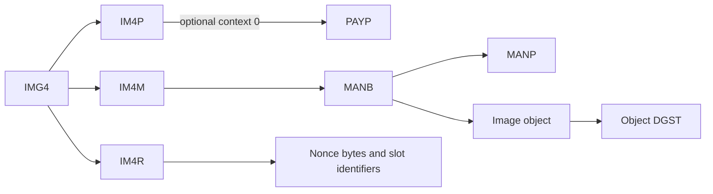

# Image4 audit of ten loaded IDA databases

Audit date: 2026-10-07. Findings apply to the SHA-256 identities in [verified-identities.json](ida/verified-identities.json). That file records Mach-O UUIDs, install names, library versions, and build-version fields. The SDK field is 27.2.0 in these inputs; this identifies build metadata and does not establish a released operating-system version.

All ten requested binaries were examined through primary function/string inventories, imports, references, native data tables, and targeted decompilation. The audit inventories **15,189 primary functions**, selects **3,492 functions for relevance triage**, and retains **124 distinct function decompilations**. Selection is not equivalent to decompilation or complete semantic verification. This is a bounded static audit of every requested input, not an assertion that every instruction or possible runtime path has been verified. The [audit index](audit-index.json) gives exact functions, addresses, and evidence files.

## Implemented changes

| Finding | Result in img4-dump | Primary evidence |
|---|---|---|
| Native PAYP envelope | Parses `[0] EXPLICIT SEQUENCE { "PAYP", SET { properties } }`; covers all four combinations of optional KBAG/compression. Bare PAYP remains a compatibility form. Malformed optional wrappers are warned about and skipped. | V2 `_DERImg4DecodePayloadWithProperties` at `0x2caddaacc`; libauthinstall `_AMAuthInstallApImg4CreatePayloadWithProperties` at `0x2428659f4`; [item specifications](ida/der-item-specs.json), [encoder](ida/decompile-authinstall-measure.json). |
| Standalone restore information | Recognizes standalone IM4R, extracts typed properties and BNCN, and preserves its original bytes for `--dump-im4r`. `anid` and `snid` describe numeric AP/SEP nonce-slot identifiers. | V2 `_image4RestoreInfoInit` at `0x2cadc712c`; ramrod reader `sub_2CD959F04` at `0x2cd959f04` plus its two callers; [restore API](ida/decompile-v2-extended.json), [slot reader](ida/decompile-ramrod-slot-reader.json), [callers](ida/decompile-ramrod-slot-functions.json). |
| Exact envelope consumption | Rejects unrelated bytes after a top-level DER object and after explicitly parsed component/property envelopes. | V2 `_Img4DecodeInitManifestCommon` at `0x2cadccda4` compares decoded length with the supplied length; libimage4 `_DERImg4DecodeProperty` at `0x2438cb2a4` rejects additional elements/bytes; [initialization](ida/decompile-im4c.json), [property accessors](ida/decompile-typed-accessors.json). |
| Correct property metadata | `type` is INTEGER; `data` is BOOLEAN. `love` and `vnum` are OCTET STRING values. Adds native nonce/hash/UUID/format fields and distinguishes opaque bytes from explicitly named hashes. Wrong scalar types retain bytes with an anomaly. | [62 native property records](ida/libimage4.dylib.properties.json); `_manifest_impose_property` at `0x2438afb48`; `_Img4DecodeGetPropertyData` at `0x2438cc074` requires tag 4. [Dispatch](ida/decompile-property-version-decode.json), [accessors](ida/decompile-typed-accessors.json). CryptexKit independently exposes integer `type`/`styp` and Boolean `data`: [wrappers](ida/decompile-cryptexkit.json). |
| Image-entry vocabulary | Adds 223 native entry aliases covering 203 distinct FourCCs. Multiple aliases are retained. Removes the invented scalar-property meanings for `gdmg`, `ginc`, `ginf`, `gtcd`, and `gtgv`. | `_AMAuthInstallApImg4GetTypeForEntryName` at `0x2427e7d34` iterates 223 pairs in `kImg4Types` at `0x269176518`; [lookup](ida/decompile-authinstall-types.json), [recovered pairs](ida/libauthinstall.dylib.image-types.json), [generated metadata](../src/image_types.json). |
| LZFSE framing | Adds the missing `bvx1` start magic alongside `bvx2`, `bvxn`, and `bvx-`; `bvx$` remains an end marker. | Ramrod `_lzfse_decode_buffer_output_size` at `0x2cd9bd98c` handles all five block markers: [native decoder](ida/decompile-ramrod-compression.json). Apple's [LZFSE header](https://raw.githubusercontent.com/lzfse/lzfse/master/src/lzfse_internal.h) independently defines these markers. |
| Compression method uncertainty | Method 0 now displays `unknown(0)`, replacing the unsupported `0 = LZSS` assertion. Method 1 retains the interoperable LZFSE label. LZSS dispatch depends on the `complzss` payload header. | Native `_Img4DecodeGetPayloadCompressionInfo` at `0x2438cb780` accepts IDs 0 and 1 but does not associate them with codecs: [getter](ida/decompile-der-type-checks.json). The independent [PyIMG4 writer](https://raw.githubusercontent.com/m1stadev/PyIMG4/master/pyimg4/parser.py) emits method 1 for LZFSE. The semantics of method 0 remain **unknown**. |

The parser still serves inspection rather than trust evaluation. It accepts some representations the native ordered schema rejects, including the compatibility bare PAYP form and manifest versions above 2. Exact envelope consumption does not imply complete X.690 DER conformance.

## Coverage by requested binary

Counts below refer to the primary `__TEXT,__text` range. Decompiled counts include distinct cold functions where collected; duplicate addresses and failed resolutions are excluded.

| Binary / IDA target | Functions / selected / decompiled | Findings and boundaries |
|---|---:|---|
| AppleMobileFileIntegrity.merged / `9112d92f2593` | 398 / 18 / 4 | Trust-cache lookup, local-signing interface, certificate-chain copying, and lightweight code requirements. Primary `amfi_interface_cdhash_in_trustcache` at `0x21a93c240` and local-signing routine at `0x21a93c5f8` do not establish Image4 container parsing or portable manifest authorization. [Evidence](ida/decompile-amfi.json). The additional 12 merged dependency text ranges were separately inventoried, including Security/CMS code; the name scan found no named Image4 decoder. This is a scoped negative result, not proof of absence in unnamed code. [Extended inventory and all 8,971 imports](ida/AppleMobileFileIntegrity.merged.extended.json). |
| CryptexKit / `0d560b30c6c5` | 4,572 / 417 / 9 | Integer `type`/`styp`, Boolean `data`, nonce-spec wrappers, and evaluation/authentication wrappers. The wrappers use the native trust framework; reading a scalar after evaluation is distinct from arbitrary ASN.1 extraction. Swift generic/runtime support explains many inventory hits. [Property wrappers](ida/decompile-cryptexkit.json), [nonce/evaluation wrappers](ida/decompile-kit-nonce-evaluate-retry.json). |
| libauthinstall.dylib / `4cb2b5384360` | 4,062 / 1,263 / 14 | Independent PAYP encoder/decoder, all 223 image-entry mappings, restore-info encoding, separate payload/property measurements, TBM/memory-map/raw-data-digest metadata, and SHA-3-384 support in the digest-type dispatcher. Peripheral firmware/FTAB/UARP and IMG3 routines are separate formats. [Measurement path](ida/decompile-authinstall-measure.json), [type/hash dispatcher](ida/decompile-authinstall-types.json), [Cryptex1 metadata](ida/decompile-authinstall-nonce.json). |
| libcryptex_core.dylib / `6882028eab8b` | 473 / 55 / 12 | Asset vocabulary, dynamic nonce-domain handles, raw asset-file digesting, manifest signing/locking paths, and conditional object-digest fingerprint construction. The asset table includes both image objects and structural directory/manifest entries. [Asset table](ida/libcryptex_core.dylib.assets.json), [fingerprint path](ida/decompile-core-signature.json), [object generator and file digest](ida/decompile-core-digest-objects.json). |
| libcryptex_interface.dylib / `89c7194f06b9` | 198 / 24 / 4 | XPC schemas carry image, trust-cache, manifest, information and volume-hash descriptors separately. `image-type-index`, nonce-domain handle, authentication, persistence, and nonce persistence are distinct fields. These are transport values, not ASN.1 compression/digest identifiers. [Request construction and validation](ida/decompile-interface.json). |
| libcryptex_trampoline.dylib / `677b8c997b14` | 12 / 0 / 12 | All primary functions, including three cold functions, were decompiled. Options allocation, naming, logging, `kern.proc_rsr_in_progress`, and upgrade-wait dispatch supply no additional Image4 serialization rule. [Main functions](ida/decompile-trampoline.json), [cold functions](ida/decompile-trampoline-cold.json), [last cold function](ida/decompile-trampoline-final-cold.json). |
| libcryptex.dylib / `c7bcdb863eb7` | 554 / 93 / 3 | Manifest attachment/copying and remote device property construction. Nonce transport and personalization delegate to the core/native Image4 APIs. No additional container grammar was established in the inspected paths. [Evidence](ida/decompile-cryptex-metadata.json). |
| libImage4_V2.dylib / `ed3cb4aaaff9` | 636 / 372 / 18 | Independent native item specifications, PAYP/IM4R decoding, IM4C certificate structure, certificate properties/public keys, exact input-length checks, and ML-DSA/hybrid verification entry points. [DER decoding](ida/decompile-ed3cb4aaaff9-0.json), [IM4C initialization/verification](ida/decompile-im4c.json), [extended API](ida/decompile-v2-extended.json). |
| libimage4.dylib / `54bf8b211d08` | 1,147 / 648 / 35 | Property descriptors/types/constraints, exact property decoding, separate hash domains, canonical INTEGER behavior, ordered schema matching, IM4C and hybrid/ML-DSA verification. Runtime environment and nonce constraints remain separate from structural parsing. [Property layout](ida/decompile-property-layout.json), [DER/type rules](ida/decompile-der-type-checks.json), [hash measurement](ida/decompile-measurement.json), [verification dispatch](ida/decompile-property-version-decode.json). |
| libramrod.dylib / `79ce35529ddc` | 3,137 / 602 / 13 | Independent payload/manifest encoder and stitching, whole-manifest measurements, nonce-slot consumers, signature/certificate extraction, and LZFSE block/size decoding. APFS/parallel compression routines are not Image4 compression metadata. [Encoder](ida/decompile-ramrod-encode.json), [signature extraction](ida/decompile-ramrod-restore.json), [compression](ida/decompile-ramrod-compression.json). |

## Additional additions established by the audit

These are identified implementation opportunities. They are not represented as completed features.

**F1 — IM4C inspection and certificate classification; impact high.** The native certificate schema is `SEQUENCE { IA5String("IM4C"), INTEGER(version), SET(body), OCTET STRING(signature) }`. The body exposes private-tagged `CRTP` and `PUBK`; PUBK is OCTET STRING. `_DERImg4DecodeCertificate` at V2 `0x2caddadb0` selects this four-field schema. `_DERImg4DecodeCertificatePropertiesAndPubKey` at `0x2caddade0` extracts certificate properties/public key. Versions 0–2 pass the common native version bound. [Specifications](ida/der-item-specs.json), [certificate extraction](ida/decompile-im4c.json). A standalone IM4C model could preserve the raw body, public key, and signature. Existing `--dump-im4m-certs` treats extracted items as X.509 and emits `CERTIFICATE` PEM labels; it does not identify IM4C. A generic extraction/PEM label does not prove X.509 structure. [A1–A3]

**F2 — Signature-scheme metadata; impact high.** The native implementation includes ML-DSA-87 and a hybrid scheme that invokes RSA-4096 verification followed by ML-DSA-87 verification. Separate `NoPQC` entry points exist. `_verify_signature_hybrid_scheme3` at `0x2438d2414` is direct evidence of the two-stage path; `_verify_signature_ml_dsa_87` at `0x2438d22a4` includes a 2,592 B public-key-length check and runtime availability checks. [Verification dispatch](ida/decompile-property-version-decode.json). Algorithm availability, algorithm selection, signature validity, and environment authorization are separate results. An inspection feature could report recognized encodings and scheme identifiers; full trust evaluation additionally needs roots, callbacks, and environment constraints. [A1, A3, A4]

The V2 hybrid cast functions require a 3,129 B public-key container and a 5,160 B signature container. [Native size checks](ida/decompile-v2-extended.json). For comparison, ML-DSA-87 has a 2,592 B public key and a 4,627 B signature in [FIPS 204, Table 2, DOI 10.6028/NIST.FIPS.204](https://nvlpubs.nist.gov/nistpubs/FIPS/NIST.FIPS.204.pdf). A 4,096-bit RSA component occupies `4,096 bit / (8 bit/B) = 512 B`; signature payload sizes then give `512 B + 4,627 B = 5,139 B`, and `5,160 B − 5,139 B = 21 B` of remaining container bytes. The subtraction is an exact size comparison; it does not by itself establish a complete container layout or RSA public-key encoding. [A1, A3]

**F3 — Preserve hash input spans and expose separate measurements; impact high.** The APIs hash different byte ranges:

| Domain | Native evidence | Consequence |
|---|---|---|
| Whole IM4P DER | `_Img4DecodeCopyPayloadDigest` at `0x2438d0bc4`; `_Img4DecodeInitPayload` at `0x2438cc220` records the full input span. [Evidence](ida/decompile-measurement.json), [digest routine](ida/decompile-54bf8b211d08-1.json). | Hashing extracted `im4p.bin` alone does not reproduce this measurement. |
| Whole IM4M DER | `_Img4DecodeCopyManifestDigest` at `0x2438d0ca4`; ramrod `_ramrod_copy_manifest_digest_data_from_img4` at `0x2cd96c3b0`. [Evidence](ida/decompile-measurement.json), [ramrod path](ida/decompile-ramrod-encode.json). | Manifest signature bytes/certificate bytes are included in this whole-component domain. |
| PAYP encoded span | `_Img4DecodeCopyPayloadPropertiesDigest` at `0x2438d1018` hashes the supplied DER item; libauthinstall separately hashes the with-properties decoder's PAYP span. [Digest API](ida/decompile-54bf8b211d08-1.json), [measurement caller](ida/decompile-authinstall-measure.json). | Property measurement is distinct from payload data and whole-payload measurement. |
| Signed body SET | IM4C verifier hashes the body span before verifying its signature; descriptor flag 8 retains that SET's full TLV. [Verifier](ida/decompile-im4c.json), [item specifications](ida/der-item-specs.json). | JSON conversion or property reordering cannot substitute for preserving the original signed bytes. |
| Raw data digest | libauthinstall copies `rddg` into `RawDataDigest`, distinct from its payload/property measurement dictionary entries. [Measurement caller](ida/decompile-authinstall-measure.json). | A generic “digest” result loses the byte-domain distinction. |

libauthinstall also has a path that recreates a payload with an overridden tag before measuring it. Thus an original-input digest and a retagged serialization digest can differ. A future comparison operation needs explicit domain and algorithm fields rather than selecting an algorithm solely from digest length. The current tool preserves raw IM4M/IM4R and payload data but does not expose a complete raw IM4P component. [A1, A3, A5]

**F4 — Cryptex semantic fingerprint; impact medium.** `_cryptex_signature_create` at `0x2cb801414` conditionally constructs a fingerprint from object DGSTs. The object traversal order is `c411, gdmg, ginc, ginf, gtcd, gtgv, ltrs, pdmg`. Missing objects are skipped; errors other than the missing-property result abort construction. `_generate_manifest` at `0x2cb8036a0` constructs MANP with `acdc = true`; `_generate_objects` at `0x2cb803758` carries the present object digests. The generated manifest's retained body SET is then passed to the configured digest callback and rendered as 48 B of hex digest. [Control flow](ida/decompile-core-signature.json), [manifest generator](ida/decompile-core-fingerprint.json), [object generator](ida/decompile-core-digest-objects.json), [assembly and packed FourCC constants](ida/fingerprint-object-order.json). The independent `_cryptex_signature_compute_hash` path measures the original manifest buffer. The exact native feature-gate semantics and portable encoder equivalence remain **unknown**. [A1, A3–A5]

```text
if native_feature_gate():
    records = []
    for code in [c411, gdmg, ginc, ginf, gtcd, gtgv, ltrs, pdmg]:
        result, bytes = native_get_object_data(manifest, code, DGST)
        if result == MISSING: continue
        if result != SUCCESS: return error
        records.append(code, bytes)
    generated = native_encode_manifest(MANP={acdc: true}, objects=records)
    fingerprint = native_digest_callback(generated.signed_body_SET_TLV)
```

This pseudocode preserves observed control/data dependencies and deliberately leaves encoding/digest configuration to the native operations. With `k ≤ 8` objects and `n` manifest bytes, repeated linear property searches cost `O(k n)` time; stored records/body cost `O(n)` space. An indexed portable implementation could parse once in `O(n)` time and `O(n)` space, but byte-equivalent output requires a differential encoder fixture. Serialization order and SET canonicalization are not proven by traversal order alone. [A3–A5]

**F5 — Structured payload-version metadata; impact medium.** The IM4P version/description field has an IA5String tag, but native `_Img4DecodeGetPayloadVersionPropertyString` at `0x2438d13d0` interprets its bytes as a structured property container in a special path. libauthinstall extracts `tbms`/`tbmr` as TBMDigests and PAYP `mmap` as MemoryMap. [Version accessor](ida/decompile-property-layout.json), [measurement path](ida/decompile-authinstall-measure.json). This field is distinct from the OCTET STRING `love`/`vnum` manifest properties. The current lossy UTF-8 rendering of the IM4P description does not preserve every original byte. A raw-byte field plus optional structured decoding could retain this information without assigning unsupported semantics to unknown properties. [A1, A3]

**F6 — Native-schema validation mode; impact high.** Native property decoders require equality between the private outer FourCC tag and the inner IA5String FourCC, exactly two property elements, and expected class/type. The sequence parser matches an ordered specification, skips optional fields, and rejects additional fields. INTEGER64 parsing rejects negative values, empty values, and unnecessary leading zero octets; unsigned widths are bounded. The compression getter reads two unsigned 32-bit INTEGERs and limits the method to 0 or 1. [DER parsing](ida/decompile-der-type-checks.json), [property parsing](ida/decompile-property-layout.json), [typed getters](ida/decompile-typed-accessors.json). These constraints exceed the current inspection parser. A separate validation result could expose structural mismatches without conflating them with cryptographic validity. X.690 supplies the underlying ASN.1 encoding terminology: [ITU-T X.690](https://www.itu.int/rec/T-REC-X.690/en). [A1–A3, A6]

**F7 — Hash algorithm namespaces; impact medium.** `_AMAuthInstallCryptoCreateDigestForDataType` at `0x2427f5374` dispatches `1 → SHA-1`, `0x100 → SHA-256`, `0x180 → SHA-384`, and `0xD38 → SHA3-384`. Unsupported values fail. In contrast, libimage4 `_CTImg4GetDigestType` at `0x2438b1328` maps SHA-384's OID to value 8 and uses a different enum. [Authinstall dispatcher](ida/decompile-authinstall-types.json), [OID dispatcher](ida/decompile-property-version-decode.json). Neither namespace is an IM4P compression-method namespace. Exported constants alone do not prove that a particular dispatcher supports them. [A1, A3]

**F8 — Nonce-domain/context reporting; impact medium.** `BNCH` appears in multiple property descriptors with different contexts, including boot, Cryptex, and installation domains. `BNCN`/`cncn`/`cncx` carry nonce bytes; `anid`/`snid` identify slots; `ndom`/`lndm` identify domains. Core `_cryptex_core_get_nonce_domain_handle` at `0x2cb7f2fa8` reads a handle from Cryptex1 properties. Interface `_remote_service_create_nonce_handle_request` at `0x24734420c` transports a 32-bit handle. [Property contexts](ida/libimage4.dylib.properties.json), [core](ida/decompile-core-signature.json), [transport](ida/decompile-interface.json). A fixed global mapping from one FourCC or Swift enum to a nonce-domain handle is not established. [A1–A4]

## Bounded expansion: analytical patterns and risks

| Pattern / risk | Impact | Established boundary |
|---|---|---|
| Visualize object/property associations and byte-domain measurements | High | The native container hierarchy and per-object DGST association supply graph edges. Hash lengths or loose FourCC scans do not establish identity or signature validity. F1–F3, F8. |
| Preserve ambiguous image aliases and domain-specific property meanings | Medium | 223 mappings reduce to 203 codes; `BNCH` has multiple contexts. No unique firmware identity can be inferred from the FourCC alone. |
| Runtime-dependent native verification | High | Roots, environment constraints, nonce state, callback availability, and separate NoPQC paths exceed an offline structural decoder. No portable authorization result is claimed. F2, F8. |
| Preflight decompression allocation from framed block lengths | Medium | Ramrod's size scanner validates block boundaries and accumulates output sizes. A portable bounded scanner could avoid unnecessary growth allocations. The current decoder retains its allocation ceiling; a scanner is not implemented here. |
| Distinguish IM4C from X.509 in certificate output | High | Format recognition can prevent incorrect presentation; generic DER/PEM output is not a successful X.509 parse. F1. |
| Reuse AMFI CMS/code-signing functions as Image4 grammar evidence | Low | The audited AMFI primary paths and merged dependency names establish no such grammar. Native code-signing interfaces remain a separate subsystem. |

The established container relationships can be represented without treating opaque hashes as decoded identities:



## Assumption register and falsification probes

All native findings depend on A1–A3 unless a narrower dependency is stated. Unknowns are explicit boundaries rather than fabricated answers.

| ID | Assumption / limit | Stress test or falsification probe | Dependent results |
|---|---|---|---|
| A1 | Conclusions are build-specific to the ten recorded input hashes. | Recompute input SHA-256; fail on any difference. Re-run tables/decoders on a second build before generalizing. | All native findings. |
| A2 | Primary Mach-O text attributes implementation to its named input; supplemental dyld ranges are separate. | Compare LC_SEGMENT_64 ranges, IDA function addresses, and raw file offsets. AMFI merged dependency ranges were separately name-inventoried. | Coverage and scoped negative results. |
| A3 | Decompiler output approximates control/data flow; inferred prototypes can be wrong. Raw tables and specific instructions corroborate implementation changes. | Compare item/descriptor bytes against the input; inspect call-site assembly before porting argument layouts. All 62 recorded property bytes also matched live IDA bytes. | Native schemas, metadata, algorithm observations. |
| A4 | External callbacks resolve according to the native API contract during normal execution. Hooking, unavailable weak imports, and runtime configuration can change outcomes. | Resolve callback targets in the executing process and compare return values with controlled fixtures. No runtime authorization was performed. | F2, F4, F8. |
| A5 | Portable reserialization could match the native encoder only after explicit equivalence checks. Equivalence is currently unknown. | Differentially compare signed SET/PAYP bytes; vary object ordering, missing objects, metadata, nonce and signatures independently. | F3/F4 portable digest/fingerprint proposals. |
| A6 | Method 1's LZFSE meaning has independent writer interoperability evidence; method 0's meaning is unknown. Native accepted-ID bounds are not codec definitions. | Obtain native-produced method-0 samples and trace the consuming decoder. Code now reports method 0 as unknown and uses magic for codec dispatch. | Compression metadata and F6. |
| A7 | Synthetic regression fixtures test implemented behavior; they do not establish full production-firmware coverage. | Add native-produced IMG4/IM4P/IM4M/IM4R fixtures covering encrypted, compressed, hybrid-signed and malformed variants. | Test claims and implementation coverage. |
| A8 | Symbol/string/reference triage can miss unnamed routines, indirect references, computed tags, and unexecuted paths. | Examine immediate FourCC constants and indirect call/data flows beyond selected families; perform differential native fuzzing with a defined oracle. | Completeness limits and all negative findings. |

## Reproducibility and validation

`python3 research/tools/verify_evidence.py` independently verifies all ten input SHA-256 values, the absence of recorded primary-text patches, 13 DERItemSpec tables, 62 property records including their labels/FourCCs, all 223 native CFString pairs, the generated 203-code alias table, and the packed fingerprint constants. The additional certificate-body table is tied to [assembly references](ida/certificate-body-spec-evidence.json). It uses Mach-O segment translation `file_offset = segment_fileoff + (EA − segment_vmaddr)` only within file-backed ranges. [Verifier](tools/verify_evidence.py), [verified result](ida/verified-identities.json).

The address translation is dimensionally a byte offset: B + (B − B) = B. DERItemSpec entries are 24 B (`3 × 8 B`); native property records are 104 B (`13 × 8 B`); image-entry pairs are 16 B (`2 × 8 B`), so the recovered image table spans exactly `223 × 16 B = 3,568 B`. Counts and fixed-width sizes are exact; no statistical error bar is asserted. Unknown coverage cannot be assigned a numerical confidence from this sample.

[collect_inventory.py](tools/collect_inventory.py) and [select_relevant.py](tools/select_relevant.py) reproduce the primary IDA inventory and selection. Run them inside each explicitly selected database, using the saved layouts and optionally setting `AUDIT_ROOT`. Selection uses symbol/string matches, four-character string anchors, and two direct-caller expansions. This is `O(F + S + R)` work for functions, strings, and visited references with `O(F + S + R)` stored evidence; fixed two-round caller expansion does not constitute whole-program reachability analysis. The byte verifier requires `O(N)` hashing/file reads and `O(N)` space, where N is the sum of input sizes; it currently retains all ten input buffers.

Regression validation:

- `cargo test --all-features`: **74 passed** = 44 unit + 4 automatic-decryption + 26 CLI tests. [Log](tests-all-features.log).
- `cargo test`: **63 passed** = 33 unit + 4 automatic-decryption + 26 CLI tests. [Log](tests-default.log).
- PAYP canonical fixtures failed against the former parser and passed after the wrapper fix.
- Fixtures cover standalone IM4R, AP/SEP slot values, exact byte preservation, outer trailing bytes, malformed PAYP wrappers, optional-field combinations, native property types, wide integers, alias ambiguity, and wrong-type raw-byte retention.
- `git diff --check` passed. No native binaries are included in the repository evidence.

The compiler emits the pre-existing redundant-homepage warning; the all-feature test build also emits the pre-existing unused-mut warning in the LZSS test helper. These are not new failures.

## Self-red-team quality gates

| Gate | Result | Evidence / scope |
|---|---|---|
| QG1 | Pass | Technical findings and changes require no normative or ethical judgment. |
| QG2 | Pass | A1–A8 identify dependencies and explicit falsification probes. |
| QG3 | Pass within declared audit scope | All ten requested inputs have identities, inventories, selection records, and distinct decompilation evidence; additional opportunities and implementation status are explicit. No exhaustive instruction-level proof is claimed. |
| QG4 | Pass | Byte widths, offsets, counts, algorithm namespaces, and size calculations are reproducible; operation/space bounds are stated. |
| QG5 | Pass for delivered claims and changes | Known type/envelope/detection errors are corrected. Inspection leniency, method-0 meaning, native callback configuration, and portable encoder equivalence remain explicitly bounded unknowns rather than implicit validity assertions. |
| QG6 | Pass | Claims cite address-specific primary binary artifacts, independently verified tables/hashes, and primary standards/source where used. |
| QG7 | Pass | Bounded analytical opportunities and risks carry impact labels and source boundaries. |
